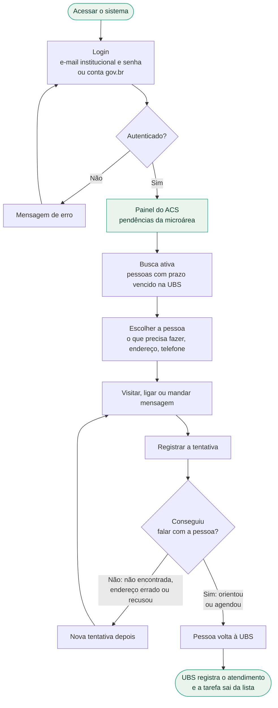
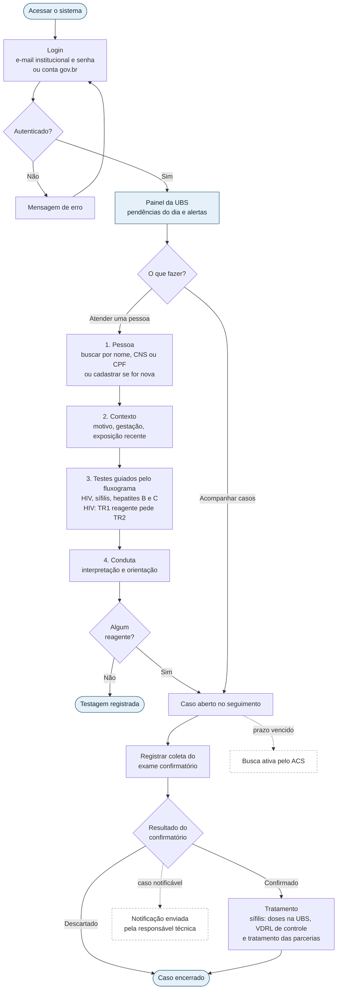
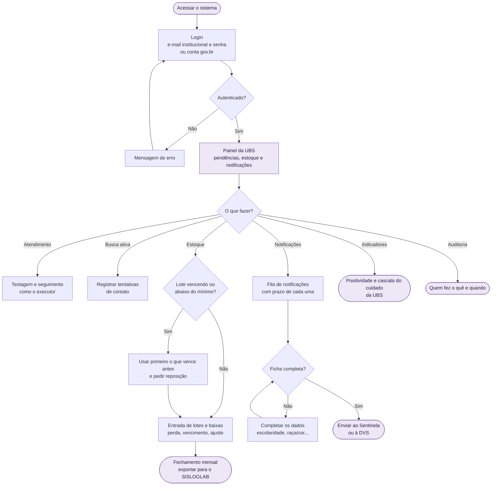
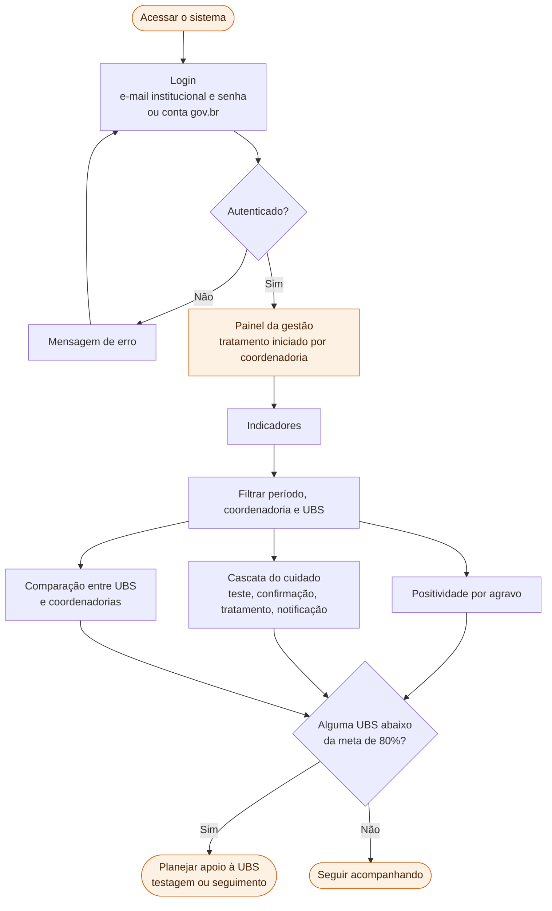
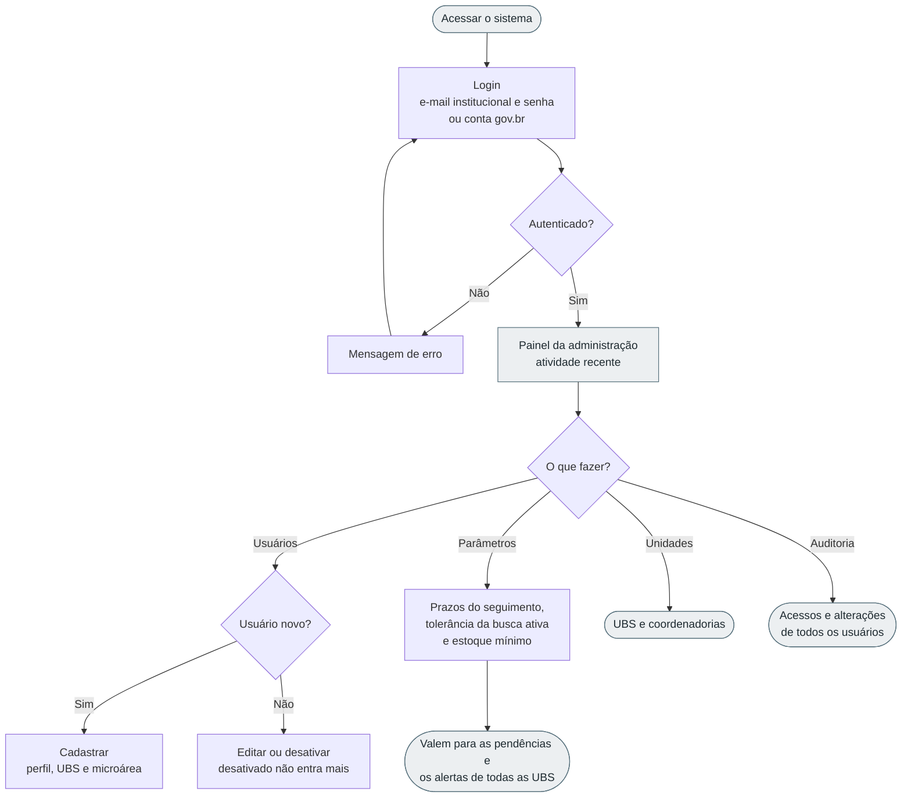
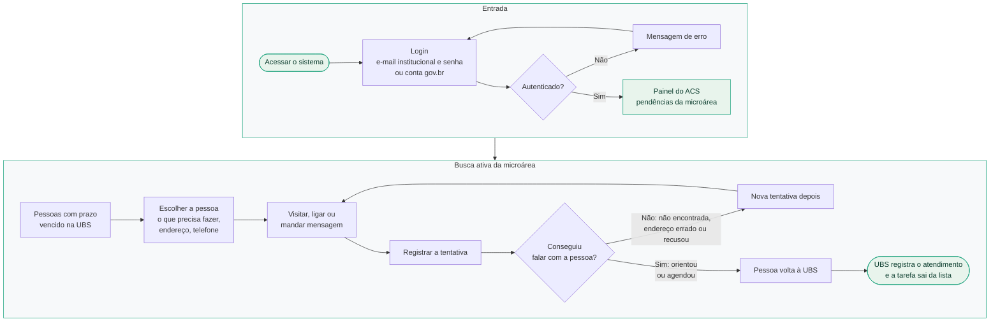
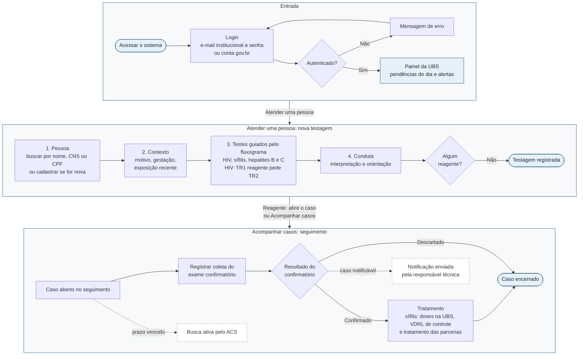
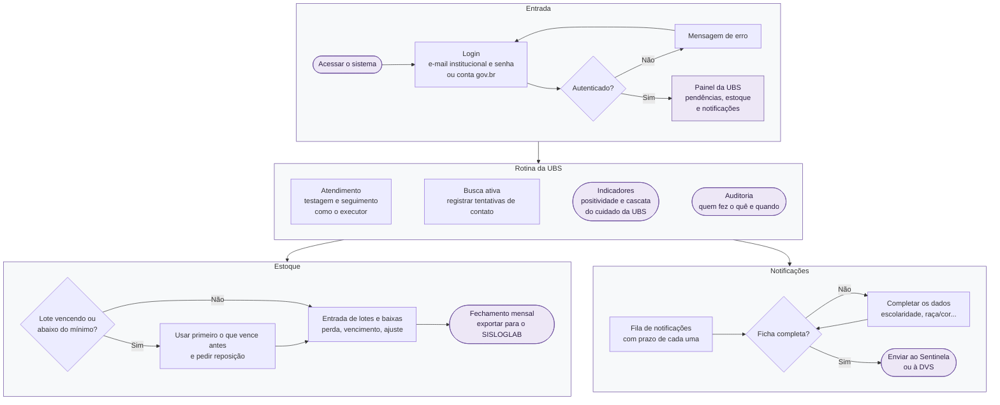
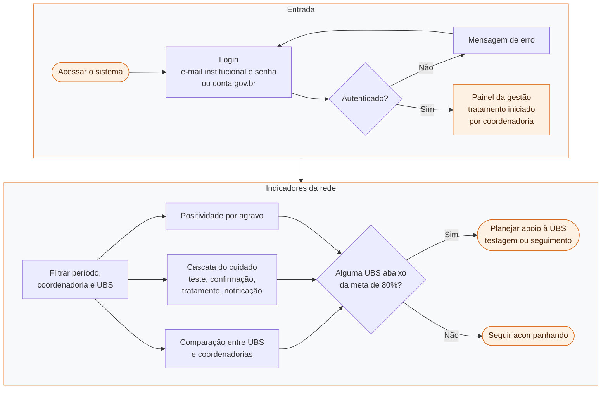
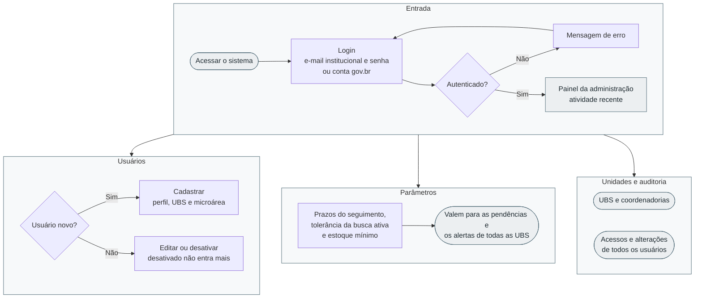

# Fluxogramas do sistema por perfil de usuário

Um fluxograma para cada perfil de acesso do sistema de gestão da testagem rápida, do login às tarefas
principais. Os diagramas estão em [Mermaid](https://mermaid.js.org/) (o GitHub desenha direto nesta página);
as imagens em PNG ficam em [`docs/fluxogramas/`](fluxogramas/), em versão vertical e horizontal
(`*-horizontal.png`, em formato paisagem, boa para slides).

| Nível | Perfil | Quem usa | Escopo |
|---|---|---|---|
| 1 | Agente comunitário de saúde (ACS) | Agente da equipe de saúde da família | Própria microárea |
| 2 | Executor(a) de teste rápido | Enfermeiro(a) ou técnico(a) que faz o teste | Própria UBS |
| 3 | Responsável técnico(a) | Enfermeiro(a) responsável pela UBS | Própria UBS, com gestão |
| 4 | Gestão APS / Vigilância | Gestão da atenção primária e DVS | Toda a rede, dados agregados |
| 5 | Administração do sistema | Suporte de TI | Sistema, sem dados clínicos |

Todos entram pelo mesmo login, com e-mail institucional e senha ou com a conta gov.br. O painel e o menu
que aparecem depois dependem do perfil.

---

## 1. ACS: agente comunitário de saúde

Vê só as pessoas da sua microárea com busca ativa pendente. Por sigilo, o diagnóstico não aparece:
a tarefa diz apenas o que a pessoa precisa fazer na UBS.

---

## 2. Executor(a) de teste rápido

Registra a testagem guiada pelo fluxograma clínico e acompanha os casos reagentes até a confirmação,
o tratamento e o encerramento.

---

## 3. Responsável técnico(a) da UBS

Faz tudo o que o executor faz e, além disso, gerencia o estoque, valida e envia as notificações,
acompanha os indicadores da UBS e consulta a auditoria.

---

## 4. Gestão APS / Vigilância

Consulta indicadores agregados por UBS e por coordenadoria de saúde. Não acessa dados identificados.

---

## 5. Administração do sistema

Gerencia usuários, unidades e parâmetros, e consulta a auditoria. Não acessa dados clínicos.

---

## Versões horizontais

Os mesmos fluxos em formato paisagem: cada etapa vira uma faixa lida da esquerda para a direita, e as faixas
seguem de cima para baixo. As imagens são os arquivos `*-horizontal.png` em [`docs/fluxogramas/`](fluxogramas/);
o código de cada uma está abaixo, para editar.

ACS (horizontal): <code>fluxogramas/1-acs-horizontal.png</code>

Executor(a) de teste rápido (horizontal): <code>fluxogramas/2-executor-horizontal.png</code>

Responsável técnico(a) da UBS (horizontal): <code>fluxogramas/3-responsavel-tecnico-horizontal.png</code>

Gestão APS / Vigilância (horizontal): <code>fluxogramas/4-gestao-horizontal.png</code>

Administração do sistema (horizontal): <code>fluxogramas/5-administracao-horizontal.png</code>

